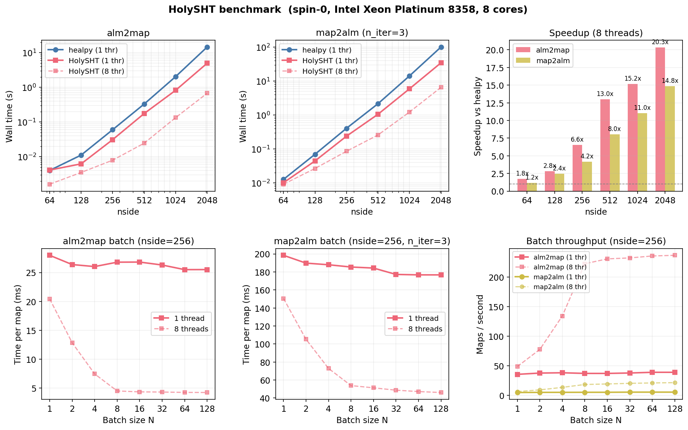

# HolySHT

Minimal MATLAB/MEX and Python wrapper for HEALPix spherical harmonic transforms,
built on a trimmed copy of the [DUCC](https://gitlab.mpcdf.mpg.de/mtr/ducc) C++
library.

Supports spin-0 (temperature) and spin-2 (polarization) transforms on HEALPix
grids, with optional partial-sky latitude bands, batch mode, and single/double
precision.

The MATLAB and Python APIs are intentionally identical: the same function names,
argument order, and options apply in both languages.

## Building

### MATLAB (MEX)

Requirements: MATLAB R2018b+, a C++17 compiler (GCC 7+, Clang 6+), CMake 3.15+.

```bash
cd HolySHT/mex
mkdir build && cd build
cmake ..
cmake --build . -j$(nproc)
```

If MATLAB is not on your `PATH`, point CMake to it:

```bash
cmake -DMATLAB_ROOT=/usr/local/MATLAB/R2024a ..
```

### Python

Requirements: Python 3.8+, a C++17 compiler, CMake 3.15+, pybind11 2.12+.

```bash
cd HolySHT/python
pip install .
```

Or build in-place for development:

```bash
cd HolySHT/python
mkdir build && cd build
cmake ..
cmake --build . -j$(nproc)
cp _holysht_core*.so ../holysht/
```

## Setup

**MATLAB** -- run the setup script once per session (or add it to your
`startup.m`):

```matlab
run('/path/to/HolySHT/setup_holysht.m')
```

This adds the `+holysht` package and `mex/build/` directories to your MATLAB
path.

**Python** -- after `pip install`, just import:

```python
import holysht
```

## API Reference

The two functions below have the same signature in both languages. The only
syntactic difference is how options are passed:

| | MATLAB | Python |
|---|---|---|
| Options | `'name', value` pairs | `name=value` keyword args |

### `alm2map` -- Spherical harmonic synthesis (alm to map)

<table>
<tr><th>MATLAB</th><th>Python</th></tr>
<tr>
<td>

```matlab
map = holysht.alm2map( ...
    alm, spin, nside, lmax)
map = holysht.alm2map( ...
    alm, spin, nside, lmax, ...
    'lat_range', [-30 30], ...
    'nthreads', 4)
```

</td>
<td>

```python
map = holysht.alm2map(
    alm, spin, nside, lmax)
map = holysht.alm2map(
    alm, spin, nside, lmax,
    lat_range=(-30, 30),
    nthreads=4)
```

</td>
</tr>
</table>

**Inputs:**

| Argument | Type | Description |
|----------|------|-------------|
| `alm` | complex `[ncomp, nalm]` or `[N, ncomp, nalm]` | Spherical harmonic coefficients. `nalm = (lmax+1)*(lmax+2)/2`. |
| `spin` | `0` or `2` | Spin weight. `ncomp = 1` for spin-0, `ncomp = 2` for spin-2. |
| `nside` | positive integer | HEALPix resolution parameter. |
| `lmax` | non-negative integer | Maximum multipole. |

**Options:**

| Name | Default | Description |
|------|---------|-------------|
| `lat_range` | `[]` / `None` (full sky) | `[lat_min, lat_max]` in degrees (+90 = north pole). Restricts output to rings within the band. |
| `nthreads` | `0` (auto) | Number of threads. |

**Output:** real `[ncomp, npix]` or `[N, ncomp, npix]`, matching input
precision. For full sky, `npix = 12*nside^2`. With `lat_range`, `npix` is
the total pixel count of selected rings.

---

### `map2alm` -- Spherical harmonic analysis (map to alm)

<table>
<tr><th>MATLAB</th><th>Python</th></tr>
<tr>
<td>

```matlab
alm = holysht.map2alm( ...
    map, spin, nside, lmax)
alm = holysht.map2alm( ...
    map, spin, nside, lmax, ...
    'n_iter', 10, ...
    'lat_range', [-30 30])
```

</td>
<td>

```python
alm = holysht.map2alm(
    map, spin, nside, lmax)
alm = holysht.map2alm(
    map, spin, nside, lmax,
    n_iter=10,
    lat_range=(-30, 30))
```

</td>
</tr>
</table>

**Inputs:**

| Argument | Type | Description |
|----------|------|-------------|
| `map` | real `[ncomp, npix]` or `[N, ncomp, npix]` | HEALPix map(s) in ring order. |
| `spin` | `0` or `2` | Spin weight. |
| `nside` | positive integer | HEALPix resolution parameter. |
| `lmax` | non-negative integer | Maximum multipole. |

**Options:**

| Name | Default | Description |
|------|---------|-------------|
| `n_iter` | `3` | Number of Jacobi refinement iterations. More iterations improve accuracy (10 gives ~1e-12 relative error). |
| `lat_range` | `[]` / `None` (full sky) | `[lat_min, lat_max]` in degrees. The input map must contain only pixels from the selected rings, packed contiguously. |
| `nthreads` | `0` (auto) | Number of threads. |

**Output:** complex `[ncomp, nalm]` or `[N, ncomp, nalm]`, matching
input precision.

---

### alm ordering convention

Coefficients use DUCC's `mstart` layout: for a given `(l, m)`, the
flat index is `mstart(m) + l`, where `mstart(m) = m * (2*lmax + 1 - m) / 2`.
This is a triangular layout with all `l` values for each `m` stored
contiguously. The total number of coefficients is
`nalm = (lmax + 1) * (lmax + 2) / 2`.

For spin-0, `ncomp = 1` and the alm array is `[1, nalm]`.
For spin-2, `ncomp = 2` and the alm array is `[2, nalm]` (E-modes in row 1,
B-modes in row 2).

## Examples

The examples below show MATLAB and Python side by side. The logic is
identical; only syntax differs.

### Spin-0 round-trip

<table>
<tr><th>MATLAB</th><th>Python</th></tr>
<tr>
<td>

```matlab
run('setup_holysht.m');

nside = 128;
lmax  = 2 * nside;
nalm  = (lmax+1) * (lmax+2) / 2;

rng(42);
alm = randn(1, nalm) ...
    + 1i * randn(1, nalm);
alm(1:lmax+1) = real(alm(1:lmax+1));

map  = holysht.alm2map( ...
    alm, 0, nside, lmax);
alm2 = holysht.map2alm( ...
    map, 0, nside, lmax, ...
    'n_iter', 10);

err = norm(alm(:)-alm2(:)) ...
    / norm(alm(:));
fprintf('Error: %.2e\n', err);
```

</td>
<td>

```python
import numpy as np, holysht

nside = 128
lmax  = 2 * nside
nalm  = (lmax+1) * (lmax+2) // 2

rng = np.random.default_rng(42)
alm = rng.standard_normal((1, nalm))\
    + 1j*rng.standard_normal((1, nalm))
alm[:, :lmax+1] = alm[:, :lmax+1].real

map  = holysht.alm2map(
    alm, 0, nside, lmax)
alm2 = holysht.map2alm(
    map, 0, nside, lmax, n_iter=10)

err = (np.linalg.norm(alm - alm2)
     / np.linalg.norm(alm))
print(f'Error: {err:.2e}')
```

</td>
</tr>
</table>

Both give ~1e-12 relative error.

### Spin-2 (polarization)

<table>
<tr><th>MATLAB</th><th>Python</th></tr>
<tr>
<td>

```matlab
nside = 64;
lmax  = 2 * nside;
nalm  = (lmax+1) * (lmax+2) / 2;

alm_EB = randn(2, nalm) ...
       + 1i * randn(2, nalm);
alm_EB(:,1:lmax+1) = ...
    real(alm_EB(:,1:lmax+1));
alm_EB(:, 1) = 0;      % l=0,m=0
alm_EB(:, 2) = 0;      % l=1,m=0
alm_EB(:, lmax+2) = 0; % l=1,m=1

map_QU = holysht.alm2map( ...
    alm_EB, 2, nside, lmax);
alm_rec = holysht.map2alm( ...
    map_QU, 2, nside, lmax, ...
    'n_iter', 10);
```

</td>
<td>

```python
nside = 64
lmax  = 2 * nside
nalm  = (lmax+1) * (lmax+2) // 2

alm_EB = (
    rng.standard_normal((2, nalm))
  + 1j*rng.standard_normal((2, nalm)))
alm_EB[:,:lmax+1] = \
    alm_EB[:,:lmax+1].real
alm_EB[:, 0] = 0   # l=0, m=0
alm_EB[:, 1] = 0   # l=1, m=0
alm_EB[:,lmax+1]=0  # l=1, m=1

map_QU = holysht.alm2map(
    alm_EB, 2, nside, lmax)
alm_rec = holysht.map2alm(
    map_QU, 2, nside, lmax,
    n_iter=10)
```

</td>
</tr>
</table>

### Batch mode

Pass a 3-D array `[N, ncomp, nalm]` to transform multiple maps at once.
The batch dimension is parallelized across threads.

<table>
<tr><th>MATLAB</th><th>Python</th></tr>
<tr>
<td>

```matlab
N = 100;
alm_batch = randn(N, 1, nalm) ...
    + 1i * randn(N, 1, nalm);
alm_batch(:,1,1:lmax+1) = ...
  real(alm_batch(:,1,1:lmax+1));

map_batch = holysht.alm2map( ...
    alm_batch, 0, nside, lmax);
alm_rec = holysht.map2alm( ...
    map_batch, 0, nside, lmax,...
    'n_iter', 3);
```

</td>
<td>

```python
N = 100
alm_batch = (
  rng.standard_normal((N,1,nalm))
  + 1j*rng.standard_normal(
      (N, 1, nalm)))
alm_batch[:, 0, :lmax+1] = \
  alm_batch[:, 0, :lmax+1].real

map_batch = holysht.alm2map(
    alm_batch, 0, nside, lmax)
alm_rec = holysht.map2alm(
    map_batch, 0, nside, lmax,
    n_iter=3)
```

</td>
</tr>
</table>

### Partial-sky latitude band

Restrict the transform to a band of HEALPix rings by geographic latitude
(degrees, +90 = north pole, -90 = south pole):

<table>
<tr><th>MATLAB</th><th>Python</th></tr>
<tr>
<td>

```matlab
map_band = holysht.alm2map( ...
    alm, 0, nside, lmax, ...
    'lat_range', [-30, 30]);

alm_band = holysht.map2alm( ...
    map_band, 0, nside, lmax,...
    'lat_range', [-30, 30], ...
    'n_iter', 3);
```

</td>
<td>

```python
map_band = holysht.alm2map(
    alm, 0, nside, lmax,
    lat_range=(-30, 30))

alm_band = holysht.map2alm(
    map_band, 0, nside, lmax,
    lat_range=(-30, 30),
    n_iter=3)
```

</td>
</tr>
</table>

### Single precision

Input precision propagates to output:

<table>
<tr><th>MATLAB</th><th>Python</th></tr>
<tr>
<td>

```matlab
alm_s = single(randn(1,nalm))...
  + 1i * single(randn(1,nalm));
alm_s(1:lmax+1) = ...
    real(alm_s(1:lmax+1));

map_s  = holysht.alm2map( ...
    alm_s, 0, nside, lmax);
alm_s2 = holysht.map2alm( ...
    map_s, 0, nside, lmax);
```

</td>
<td>

```python
alm_s = (
  rng.standard_normal((1, nalm))
  + 1j*rng.standard_normal(
      (1, nalm))
  ).astype(np.complex64)
alm_s[:,:lmax+1] = \
    alm_s[:,:lmax+1].real

map_s = holysht.alm2map(
    alm_s, 0, nside, lmax)
alm_s2 = holysht.map2alm(
    map_s, 0, nside, lmax)
```

</td>
</tr>
</table>

## Performance

Benchmark on an Intel Xeon Platinum 8358 (8 cores), comparing
HolySHT (Python) against healpy 1.19 for spin-0 transforms.



**Top row:** Single-threaded, HolySHT is 1.8--2.9x faster than healpy.
With 8 threads the gap widens dramatically: at nside=2048, `alm2map`
takes 0.67 s vs healpy's 13.7 s (**20x**) and `map2alm` takes 6.5 s
vs 97.0 s (**15x**).  HolySHT automatically detects the number of
available cores from the process CPU affinity, so multithreading works
out of the box under SLURM even when `OMP_NUM_THREADS=1`.

**Bottom row:** Batching multiple maps into a single call has no
per-map overhead single-threaded.  With 8 threads, batching enables
additional parallelism: per-map cost drops ~5x for `alm2map` and ~4x
for `map2alm` as N grows from 1 to 128.  healpy has no native batch
mode.

## Tests

**MATLAB:**

```bash
matlab -nodisplay -r "run('/path/to/HolySHT/test/run_tests.m')"
```

**Python:**

```bash
cd HolySHT/python
pytest tests/
```

Both test suites cover spin-0/2 round-trips, batch consistency, partial-sky,
single precision, and error handling.

## Licensing

This project includes code from DUCC, which is GPLv2-licensed. The full text
is in `LICENSE`.
